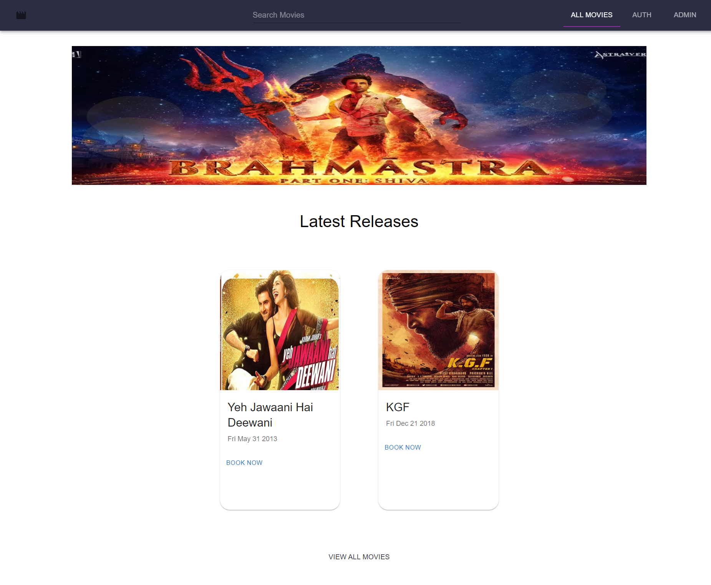

# Movie Booking App

Install Application :

 git clone https://github.com/PriyaPal001/movie-booking.git

## Features

- Auth - SignIn, LoggIn
- Fetch API for Movies-Data
- Responsive

## Change the MongoDB Atlas URL && MongoDB Password

bash
  Change the Password in .env inside backend folder

bash
  cd .\movies\
  npm i

bash
  cd .\backend\
  npm i

### Application will Run on :

bash
    http://localhost:3000

## Authors

- [@Priya Pal](https://github.com/PriyaPal001)

## Lessons Learned

- Learned About Auth
- Learn React Js Components - Data Flow
- Created *Auth.js, **getMovies*
- Learn using MongoDB, Mongoose

## Environment Variables

To run this project, you will need to add the following environment variables to your .env file

`MONGODB_PASSWORD=<password>` -- add your Password
